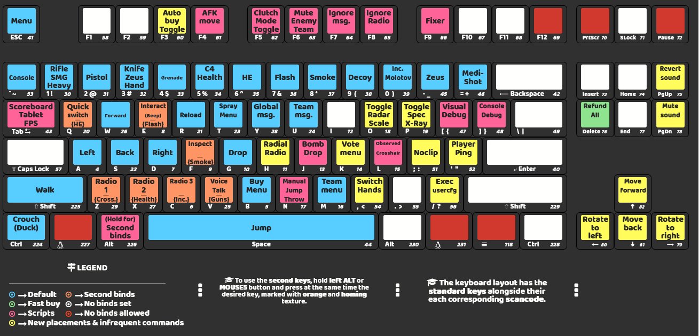

# alwj0 AutoExec - Configuración CS2 (Español)

Una configuración completa y optimizada para Counter-Strike 2 con scripts útiles, comandos documentados y configuraciones profesionales.

> **Nota:** Este es un fork/copia personalizada de [ArminC AutoExec](https://github.com/armync/ArminC-AutoExec), adaptada a mis preferencias personales y estilo de juego. Algunos archivos `.cfg` han sido modificados según mis necesidades.

## 📥 Instalación

### Pasos para Descargar e Instalar:

1. **Descarga la última versión** del config desde el repositorio.

2. **Extrae el contenido:**

   - Abre el archivo comprimido y extrae el contenido de la carpeta `cfg`
   - Copia todos los archivos a la siguiente ruta:
     ```
     \...\Steam\steamapps\common\Counter-Strike Global Offensive\game\csgo\cfg\
     ```

3. **Inicia el juego** y escribe en la consola:

   ```
   exec autoexec.cfg
   ```

4. **Si el autoexec no se ejecuta automáticamente**, intenta usar la opción de lanzamiento:

   ```
   +exec autoexec.cfg
   ```

5. **Para un nuevo escritorio o sistema operativo** (ej. Linux):
   - Asegúrate de colocar (nuevamente) todos los archivos en su lugar
   - No dejes que Steam Cloud los transfiera automáticamente

## ⚠️ Importante

- **El sistema de binds ha cambiado.** En lugar de usar el nombre de la tecla, ahora hay **scancodes asignados por tecla**. Esto asegura compatibilidad entre diferentes distribuciones de teclado e idiomas.

- **La mira, sensibilidad y viewmodel siguen el setup pro de [donk](https://prosettings.net/players/donk).** La mira está pensada para **1280x960 (4:3 _stretched_)**, que es la resolución del setup. En otras resoluciones o aspect ratios el tamaño/gap se verá distinto y puede que quieras reajustar `cl_crosshairsize` y `cl_crosshairgap`.

- **Solo limpios y válidos para CS2:** se han eliminado los comandos heredados de CS:GO que ya no existen en CS2 (`cl_interp`, `cl_interp_ratio`, `cl_cmdrate`, `cl_updaterate`, `m_rawinput`, `cl_bob*`, `net_graph`...). **No los vuelvas a añadir**: lanzan _"Unknown command"_ en cada arranque.

## 🎯 Ajustes que NO van en el .cfg (menú + panel GPU) — setup tipo donk

> ⚠️ **Esto es clave.** Un autoexec **no puede fijar de forma fiable la resolución ni la calidad gráfica** (CS2 los guarda en los settings del menú). Si quieres el rendimiento competitivo completo, configúralos **a mano** en el juego y en el panel de tu GPU.

### 🖥️ Vídeo (Configuración → Vídeo)

| Ajuste | Valor (donk) |
| --- | --- |
| Resolución | **1280 × 960** |
| Relación de aspecto | **4:3** |
| Modo de escalado | **Stretched (estirado)** |
| Brillo | 93% |
| Modo de pantalla | Pantalla completa |

### ⚙️ Vídeo avanzado

| Ajuste | Valor (donk) |
| --- | --- |
| Boost Player Contrast | **Activado** |
| Esperar sincronización vertical (V-Sync) | Desactivado |
| NVIDIA Reflex Low Latency | Desactivado* |
| Antialiasing (MSAA) | 8x MSAA |
| Calidad de sombras global | Alta |
| Sombras dinámicas | Todas |
| Detalle de modelos/texturas | **Bajo** |
| Modo de filtrado de texturas | Bilinear |
| Detalle de sombreado (shaders) | **Bajo** |
| Detalle de partículas | **Bajo** |
| Oclusión ambiental | Desactivada |
| HDR | Calidad |
| FidelityFX Super Resolution | Desactivado (máxima calidad) |

> *\*Reflex está **discutido** en 2026: donk lo lleva en **Off**. La ruta alternativa testeada para CS2 (limitado por CPU) es Reflex Off + launch option `-noreflex` + "Low Latency Mode = Ultra" en el panel NVIDIA. **No mezcles** Reflex On del juego con `-noreflex`: elige una de las dos.*

### 🟩 Panel de NVIDIA (para 4:3 _stretched_ + baja latencia)

- **Ajustar tamaño y posición del escritorio → Escalado:** `Pantalla completa`, **Realizar escalado en: GPU**, y marca **"Anular el modo de escalado configurado por los juegos"**. _(Sin esto, el 4:3 sale con barras negras en lugar de estirado.)_
- **Administrar configuración 3D (para cs2.exe):**
  - Modo de baja latencia: **Ultra** (si juegas con Reflex Off) / **On** (si usas Reflex).
  - Modo de gestión de energía: **Preferir máximo rendimiento**.
  - Sincronización vertical: **Desactivada**.
  - Frecuencia de actualización preferida: **La más alta disponible**.
- **AMD (Radeon):** equivalente en _Display → GPU Scaling + Scaling Mode: Full Panel_ y _Radeon Anti-Lag_ activado.

### 🚀 Opciones de lanzamiento

donk **no usa** ninguna. Opcionales útiles:
- `-noreflex` → solo si vas por la ruta de baja latencia sin Reflex (ver nota arriba).
- `-w 1280 -h 960` → fuerza la resolución si el menú no la respeta.

## 🌐 Red y Ping

En CS2 ya **no existen** `cl_interp`/`cl_cmdrate`/`cl_updaterate`. La interpolación la controla **`cl_net_buffer_ticks`**.

`network.cfg` **fija los defaults de CS2 en cada arranque** (defaults [verificados contra la lista de cvars del juego](https://github.com/ArmynC/ArminC-CS2-Cvars/blob/main/cvars/cvarlist.md)). Así, un valor que se haya quedado guardado en tu perfil **nunca deja la red en un estado raro** (p. ej. un `cl_net_buffer_ticks` alto que retrasa el feedback de los impactos):

| Cvar | Valor (default) |
| --- | --- |
| `rate` | `786432` (máx. del menú, estándar competitivo) |
| `cl_net_buffer_ticks` | `0` |
| `cl_net_buffer_ticks_use_interp` | `0` |
| `cl_tickpacket_desired_queuelength` | `0` |
| `cl_predict_body_shot_fx` | `0` |
| `cl_predict_head_shot_fx` | `0` |
| `cl_predict_kill_ragdolls` | `1` |

> 💡 **A ping alto (~100ms+)** puedes subir `cl_net_buffer_ticks` a **1** dentro de `network.cfg` (prueba `2` solo si `1` no basta): más buffer = más colchón de interpolación pero más retardo visual. A ping bajo, déjalo en `0`.

## 🧠 Sensibilidad / eDPI

| | DPI | Sens | eDPI |
| --- | --- | --- | --- |
| Este config | 800 | **0.8** | **640** |
| donk | 800 | 1.25 | 1000 |

640 eDPI es algo más bajo (más control/precisión, menos _flick_) — totalmente dentro del rango pro, pero es una **elección personal**, no "lo óptimo universal". Cámbiala en `mouse.cfg` si prefieres acercarte a donk.

## ⚠️ Gotchas de CS2 (2026)

- **El menú del juego pisa al autoexec.** Si cambias un valor en Configuración, CS2 lo guarda y sobrescribe al .cfg en el siguiente arranque. Para los valores del archivo, **edita el .cfg, no el menú**.
- **`host_writeconfig`** (última línea del autoexec) sigue siendo válido, pero CS2 ya autoguarda binds; si algo no persiste, revisa Steam Cloud.
- **Steam Cloud** puede pisar o borrar tus archivos: si editas a mano, considera desactivar la nube para CS2.
- **Scripts legales:** este config **no** usa null-binds / counter-strafe automatizado (te _kickearían_ por "Input Automation" desde ago-2024). El jumpthrow es manual y el bhop con rueda es input normal → todo legal en MM oficial.

## 🎯 Código de mira

Importa la mira directamente en **CS2 → Configuración → Juego → Mira → _Compartir o importar_ → pega el código → _Importar_**:

```
CSGO-TaM3Q-GFU5p-J4Mtu-bSqZw-vyJzN
```

> Es la mira **oficial de donk (verde)**. Este repo usa **la misma forma pero en cyan** (`cl_crosshaircolor_R 0 / G 255 / B 255`). Si importas el código de donk, la mira pasará a **verde** y, como el menú pisa al autoexec, se quedará así; para mantener el cyan no la importes (ya viene en `crosshair.cfg`) o vuelve a poner `cl_crosshaircolor_B 255`.

## ✅ Cómo comprobar que todo carga bien

1. Abre la consola (tecla `` ` ``) y ejecuta `exec autoexec.cfg`. Al final debe sonar el _beep_ de confirmación.
2. **Busca líneas en rojo** tipo `Unknown command "xxx"`. Este config **no debería lanzar ninguna** (por eso se limpiaron los cvars de CS:GO). Si aparece alguna, ese comando es el culpable.
3. **Verifica valores** escribiendo el cvar **sin valor** en consola (devuelve el actual):

   | Comando | Debe mostrar |
   | --- | --- |
   | `sensitivity` | `0.8` |
   | `cl_crosshairstyle` | `4` |
   | `cl_net_buffer_ticks` | `0` |
   | `rate` | `786432` |
   | `fps_max` | `600` |

4. En partida, escribe `status`: mira **tu fila** (ping / loss / rate). Si el `loss` sube, el problema es la conexión/ruta (VPN/servidor), no el config.

## 🔄 Actualización

Cuando salga una nueva versión, tienes dos métodos para actualizar:

### Método 1: Has editado el config según tus preferencias

- Revisa los nuevos commits y actualiza el config manualmente basándote en los commits.
- Esto preserva tus personalizaciones.

### Método 2: No has editado el config (o al menos no mucho)

- Elimina todo (o reemplaza los archivos cuando te lo pida).
- Vuelve a realizar los pasos de instalación.
- Después de la configuración, vuelve a cambiar tus preferencias (si es el caso).

## ⌨️ Binds



La configuración usa **scancodes** en lugar de nombres de teclas para mejor compatibilidad entre diferentes distribuciones de teclado. Cada tecla está vinculada usando su posición física en el teclado.

### Leyenda de Colores:

- 🔵 **Azul**: Binds por defecto
- 🟠 **Naranja**: Binds secundarios (mantén presionado ALT o MOUSE5)
- 🟢 **Verde**: Compra rápida
- ⚪ **Blanco**: Sin binds configurados
- 🩷 **Rosa**: Scripts
- 🔴 **Rojo**: Binds no permitidos
- 🟡 **Amarillo**: Nuevas ubicaciones y comandos infrecuentes

### Características Clave:

- **Binds secundarios**: Mantén presionado ALT o MOUSE5 para acceder a funciones secundarias
- **Scripts**: Funcionalidad personalizada para varios escenarios del juego
- **Compra rápida**: Vinculaciones de compra rápida
- **Categorías organizadas**: Los binds están categorizados por función

Para información detallada sobre los binds, consulta la página del wiki [alwj0 AutoExec Binds](https://github.com/alwj0-AutoExec/wiki/Binds).

## 📁 Archivos de Configuración

El config está organizado en múltiples archivos para facilitar la personalización:

- **autoexec.cfg**: Archivo principal que ejecuta todas las demás configuraciones
- **alwj0/audio.cfg**: Configuración de audio y optimización de sonido
- **alwj0/bind.cfg**: Todas las vinculaciones de teclas usando scancodes
- **alwj0/crosshair.cfg**: Configuración de la mira
- **alwj0/hud.cfg**: Elementos y diseño del HUD
- **alwj0/mouse.cfg**: Sensibilidad y configuración del mouse
- **alwj0/network.cfg**: Configuración de optimización de red
- **alwj0/script.cfg**: Scripts personalizados y automatización
- **alwj0/video.cfg**: Configuración de video y gráficos

## 🙏 Créditos

Esta configuración está basada en [ArminC AutoExec](https://github.com/armync/ArminC-AutoExec) por [@armync](https://github.com/armync). Este repositorio es un fork personalizado con modificaciones personalizadas para adaptarse a mis preferencias personales y estilo de juego.

Repositorio original: [https://github.com/armync/ArminC-AutoExec](https://github.com/armync/ArminC-AutoExec)
